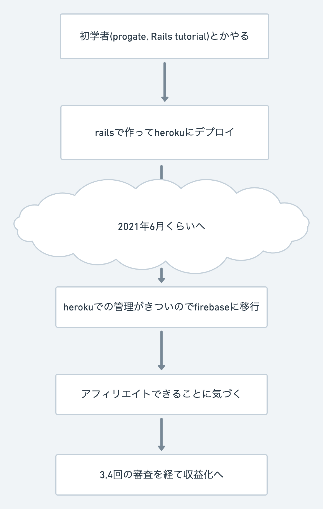
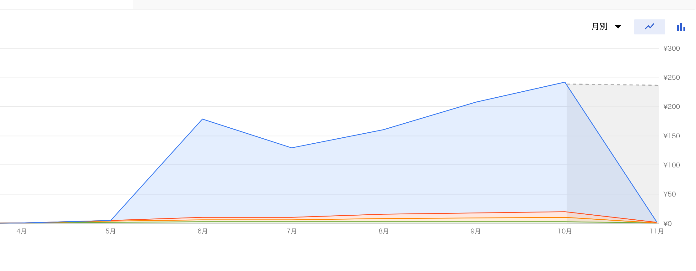
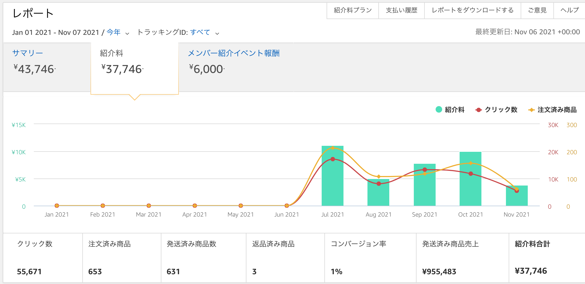
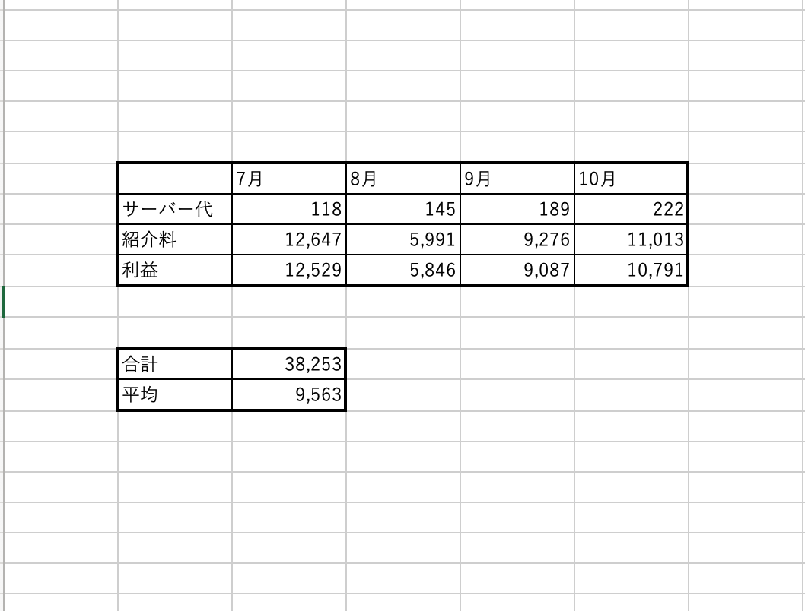

<!--
_footer: "ひろなか"

-->

# プログラミングで初めて作ったもんを収益化出来た話<!-- fit -->

---

## 作ったもの

### amazon プライムビデオの新着アニメを twitter でつぶやくだけ

---

## 時系列

---

## 技術的なとこ

### 使いまわしなので discord→twitter で

---

---

# データ保存と通知

---

---

# amazon アソシエイトについての勘違い<!-- fit -->

---

##### リンクの商品が買われたら報酬もらえるやつでしょ？

##### ならプライムビデオなんてリンクしても意味ないよなあ

---

## 実際は・・・

##### リンクが踏まれると cookie にアソシエイトタグが付与され、付与されている状態でアマゾン内で商品が購入されれば成果としてもらえる

##### cookie が消える条件は 24 時間経過 or 他の人の紹介リンクで上書きされる

---

# サーバー代

---

# 収益

---

---

# まとめ

- 工夫したとこ
  - アカウントを新と旧で分けて作った。
- 良かったとこ
  - 作ったものを便利だと言われる悦びを知った
  - 不労所得
