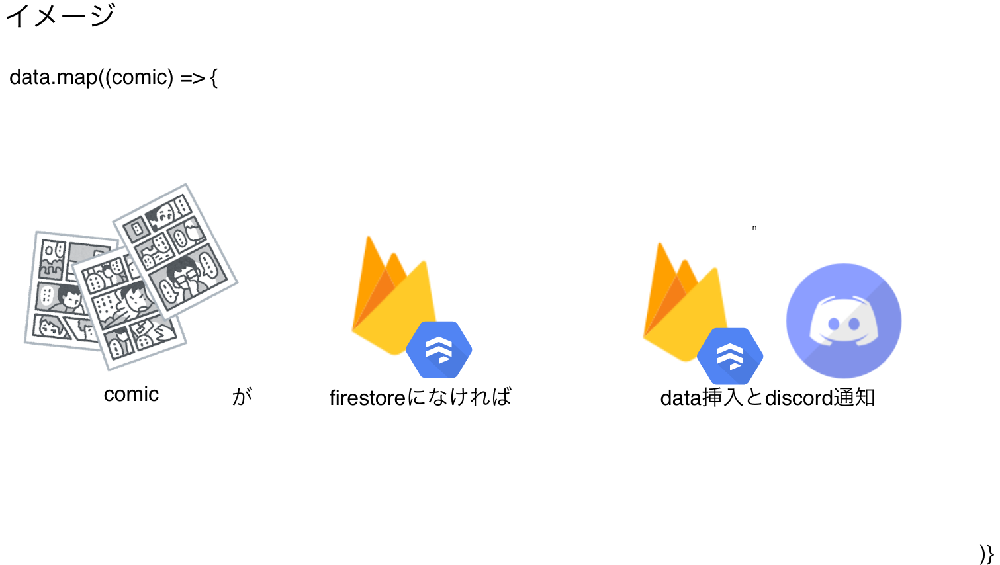
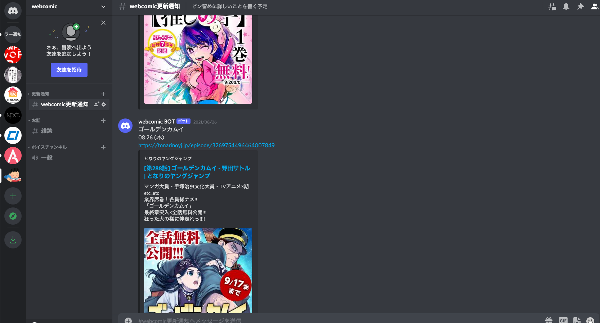
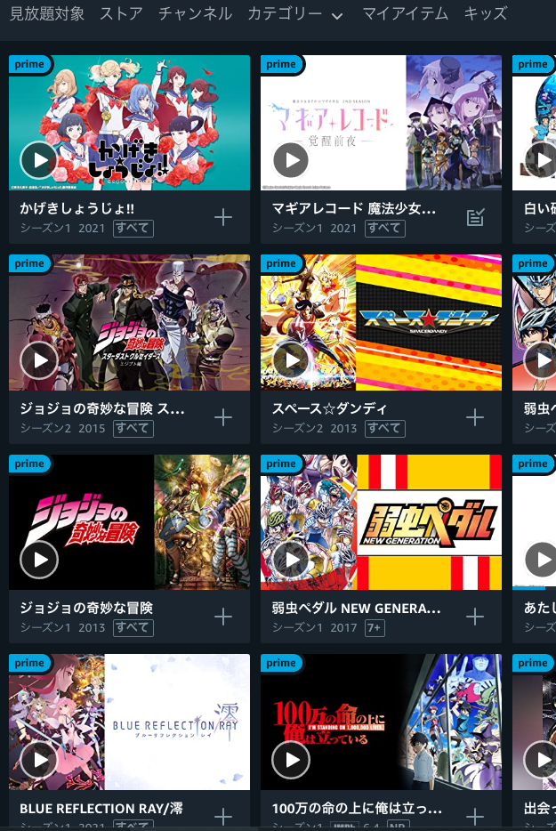
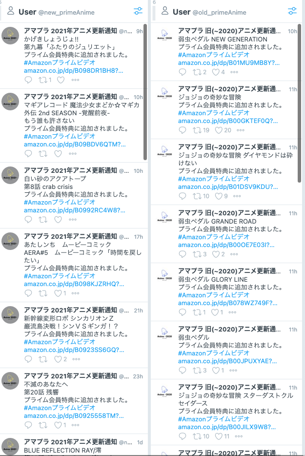
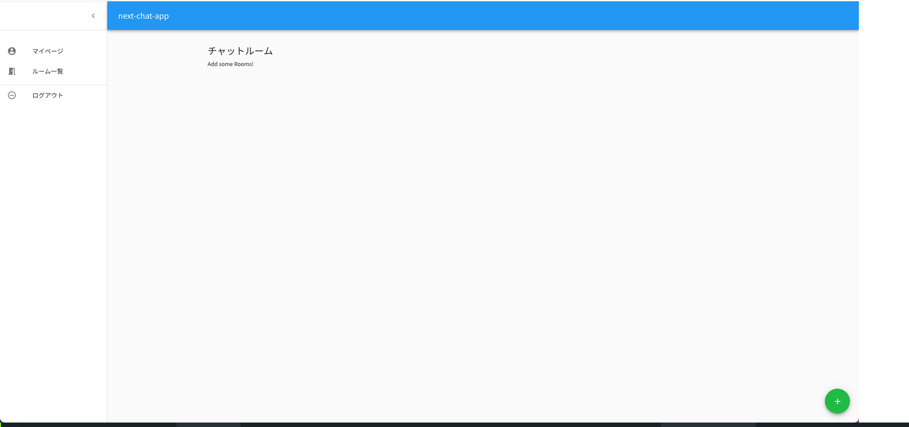
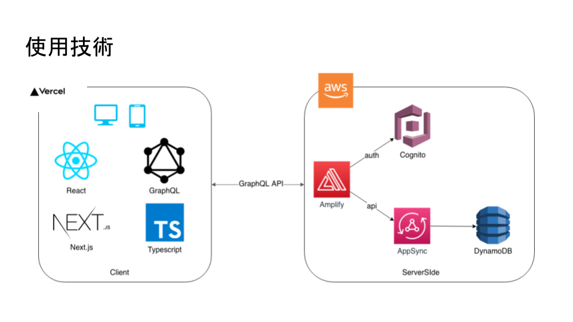
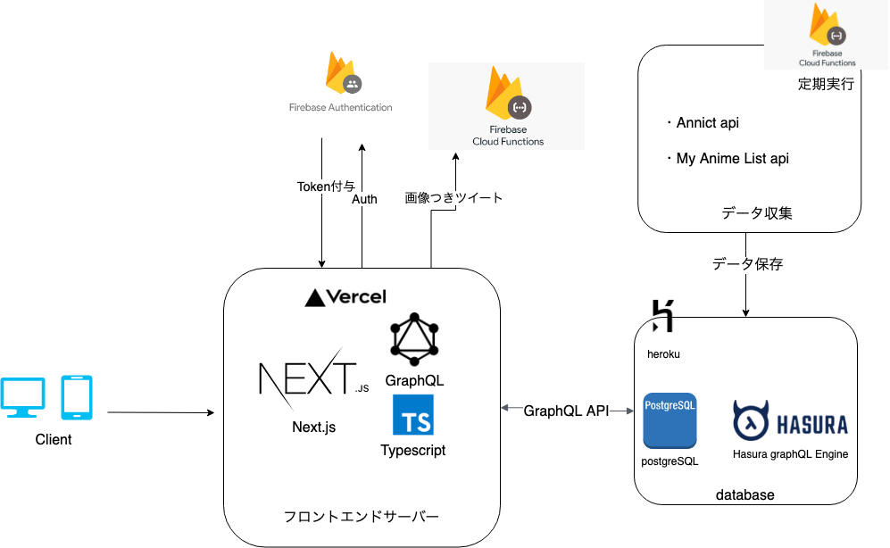

<!--
_footer: "by ひろなか"

-->

# 作成物　まとめ

---

# 目次

- 作成物の紹介（３つほど）
- おおまかなスキルマップ

---

# 更新を discord or twitter に通知する Bot<!-- fit -->

---

---

---

---

---

## 使用技術

- firebase functions
- discord webhook api, twitter api(通知用)
- puppeteer(スクレイピング)

## 使用言語

- typescript

---

# aws amplify で作ったチャットアプリ

---

---

---

# 見ているアニメを選択して画像付きツイートで共有するアプリ(WIP)

---

---

# スキルマップ

---

## フロントエンド

- React, Next
  - メインで学習　~2 年
- vue, Nuxt
  - 興味で一周さわった程度
- CSS ライブラリ, FW
  - bootstrap4, tailwindCSS, semanticUI, chakraUI ...etc

## バックエンド

- ruby, Rails
  - 初学時半年~1 年程
- php, Laravel
  - MVC, CRUD, 基本的なライフサイクル, 認証の触り

---

## サーバーレス

- firebase
  - auth, function, store 　一通りアプリに組み込んで実装

## インフラ

- aws
  - EC2 のイメージから docker compose で rails サーバー起動程度
