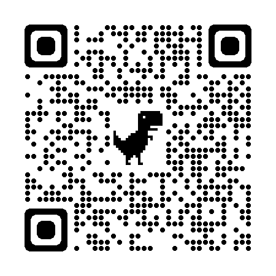

<!--
_footer: "ひろなか"

-->

# イケイケな Hello, world を作ってみた<!-- fit -->

---

## イケイケとは

### パフォーマンスが良いというやつではないです

---

## よくわかる Hello, World

---

## 技術的なとこ

- Next.js
  - 簡単に routing できる　他にも色々できる
- recoil
  - 簡単に状態管理できる
- vercel
  - 簡単にデプロイできる
- Arwes
  - 今回の目玉
    これを使いたかっただけ

---

## 作ったもの

<!--  -->

