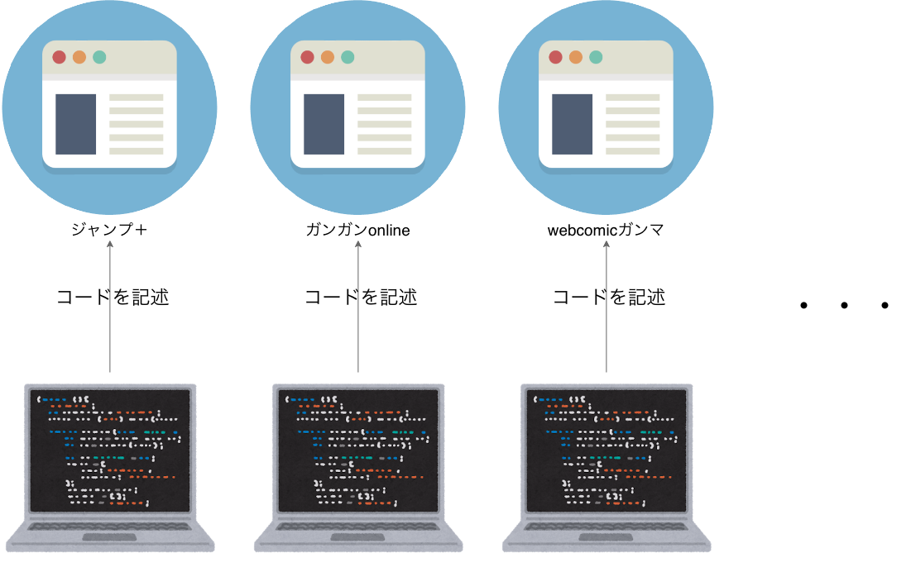

<!--
_header: "firebase functionsで"
_footer: "by ひろなか"

-->

# 読んでる web 漫画の更新を discord に通知する<!-- fit -->

---

---

# スクレイピングでデータ取得<!-- fit -->

---

---

### まとめているサイト様から許可を得て、スクレイピングする

---

# データ保存と通知

---

